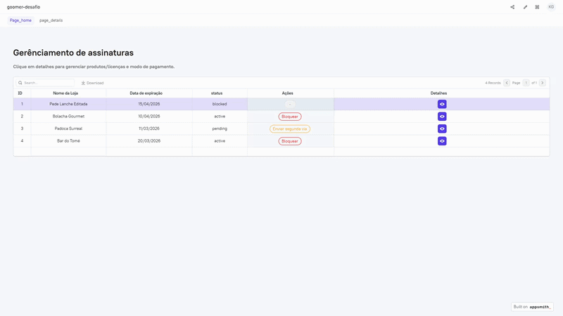
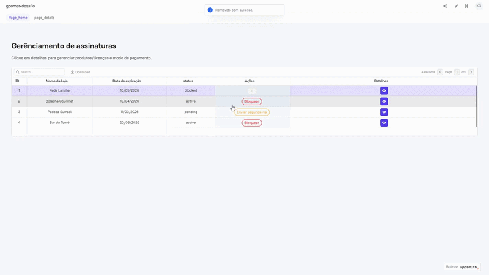
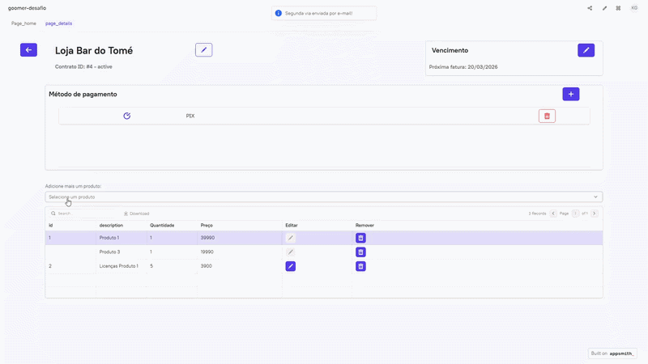
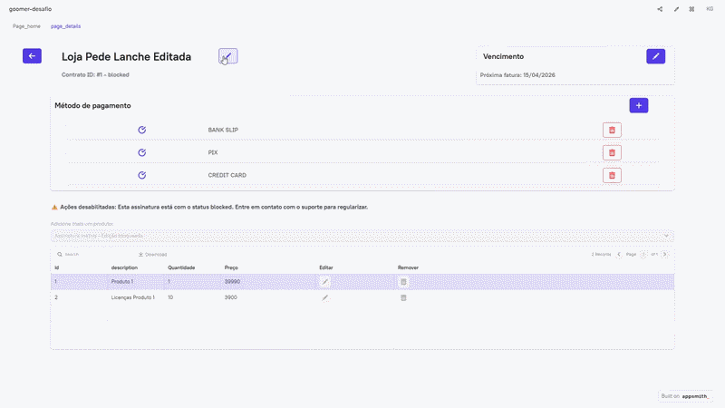

# Gerenciamento de Assinaturas (Appsmith)

Sistema **low-code** para **gerenciamento de assinaturas, contratos e produtos** para lojas. O projeto foi construído em **Appsmith**, com regras de negócio e automações em **JavaScript (ES6+)**, execução via **Docker** e integração com **API REST**.

## Tecnologias

- **Appsmith (Low-code)**
- **JavaScript (ES6+)**
- **Docker / Docker Compose**
- **Integração com API REST**

---

## Demonstração (fluxos e regras em ação)

> Os GIFs abaixo devem estar em `assets/readme/`.

### Fluxo principal (Home → detalhes)

O usuário inicia no **dashboard**, busca/filtra assinaturas e navega para a **página de detalhes** para editar contrato, pagamentos e produtos.



### Ações administrativas por status (bloquear / ativar / segunda via)

Na Home, o app expõe **ações contextuais** conforme o status da assinatura:

- **`active`**: permite **bloquear**.
- **`expired`**: permite **ativar**.
- **`pending`**: permite **enviar segunda via por e-mail**.
- **`blocked`**: **não permite ações**.



### Gestão de produtos (regras de quantidade e incompatibilidade)

A página de detalhes aplica regras de negócio na composição do contrato:

- **Edição de quantidade**: apenas **"Licenças Produto 1"** é editável.
- **Incompatibilidade**: impede adicionar **"Produto 2"** e **"Produto 3"** simultaneamente.



### Página de detalhes (edição de contrato/pagamentos/produtos)

Visão geral do fluxo na segunda página, com edição guiada e regras aplicadas na interface:

- **Restrições por status**: se `status` for **`blocked`** ou **`expired`**, a edição de **produtos** e **pagamentos** fica desabilitada.
- **Pagamentos**: ao adicionar um novo método, o seletor **filtra automaticamente** os métodos **já existentes** no contrato.



---

## Funcionalidades principais

- **Dashboard de assinaturas** com busca, filtros e listagem central.
- **Controle dinâmico de status** direto na tabela (ativar, bloquear, enviar segunda via).
- **Edição detalhada** da assinatura selecionada:
  - **Contrato** (ex.: data de expiração).
  - **Métodos de pagamento**.
  - **Produtos** do contrato.

---

## Estrutura do App (Appsmith)

### Páginas

- **`Page_home`** (Home / Dashboard)
  - Listagem e ações rápidas por assinatura.
- **`page_details`** (Detalhes)
  - Edição de contrato, pagamentos e produtos da assinatura selecionada.

### JSObjects (lógica de negócio em JavaScript)

O app centraliza lógica em **objetos JavaScript customizados**:

- **`JSObject1`** (Home)
  - `fetchAll()`: carrega assinaturas (API → cache em `appsmith.store.subscriptions`).
  - `updateStatus(id, newStatus)`: atualiza status no cache e reflete na UI.
- **`JSUtils`** (Home)
  - `fullReset()`: limpa store e cache da action `get_subscription` (útil para retornar ao estado inicial).
- **`JSDate`** (Details)
  - `updateExpiryDate(id, selectedDay)`: atualiza data de expiração (com validação de dia).
- **`JSPayments`** (Details)
  - `getPaymentMethods()`: retorna **somente métodos ainda não existentes** no contrato.
  - `addNewPaymentMethod()` / `removePaymentMethod()`: atualiza contrato (store) e lista geral.
- **`JSProducts`** (Details)
  - `getAvailableProducts()`: respeita regras de compatibilidade e evita duplicidade.
  - `addNewProduct()` / `deleteProduct()` / `updateProductQuantity()`: gestão de itens no contrato.
- **`JSStore`** (Details)
  - `updateStoreName()`: atualiza dados cadastrais/loja no contrato selecionado.

---

## Como executar

### Opção A) Rodar via Docker (recomendado)

Este repositório inclui um `docker-compose.yml` que sobe o Appsmith Community Edition.

1) Suba os containers:

```bash
docker compose up -d
```

2) Acesse no navegador:

- **HTTP**: `http://localhost:8080`
- **HTTPS**: `https://localhost:8443`

3) Logs (opcional):

```bash
docker compose logs -f
```

> Dados persistentes do Appsmith ficam montados em `./stacks` (volume do container).

### Opção B) Importar o app direto no Appsmith

Se você já tem uma instância do Appsmith rodando:

1) Acesse o Appsmith (self-hosted ou cloud).
2) No workspace, selecione **Import** / **Import Application**.
3) Importe o JSON do app:
   - `app/app.json`
4) Publique/execute a aplicação.

## Observações para devs

- O app prioriza uma abordagem **stateful** (via `appsmith.store`) para manter a experiência fluida e reduzir chamadas de rede.
- A lógica de UI (ex.: `isDisabled`) e as ações condicionais por `status` ficam em bindings do Appsmith e nos JSObjects listados acima.

